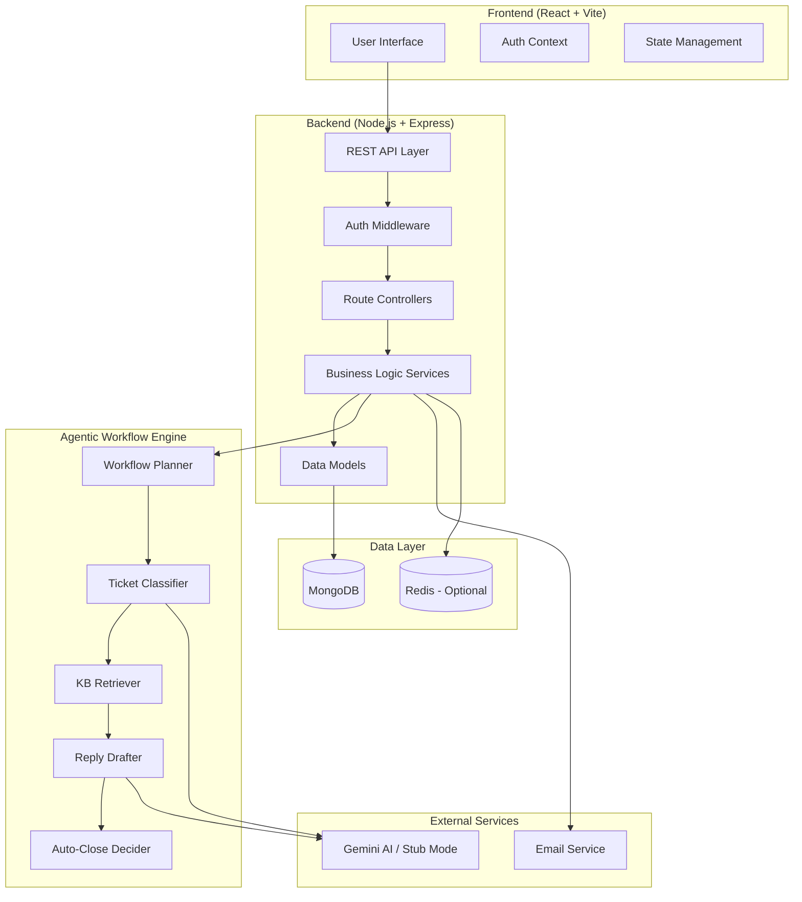

# Design Document

## Overview

The Smart Helpdesk with Agentic Triage system is designed as a modern MERN stack application that seamlessly integrates AI-powered automation with human expertise. The architecture follows a microservices-inspired approach within a monolithic Node.js backend, featuring clear separation of concerns between authentication, knowledge management, ticket handling, and the agentic workflow engine.

The system employs an event-driven architecture for the agentic triage workflow, ensuring scalability and maintainability. The AI agent operates as a deterministic state machine with fallback capabilities, supporting both external LLM integration (Gemini AI) and a stub mode for development and testing.

## Architecture

### High-Level Architecture



### System Components

1. **Frontend Layer**: React-based SPA with role-based routing and real-time updates
2. **API Gateway**: Express.js REST API with authentication and rate limiting
3. **Business Logic Layer**: Service classes handling core business operations
4. **Agentic Workflow Engine**: State machine-based AI workflow orchestration
5. **Data Access Layer**: Mongoose ODM with MongoDB for persistence
6. **External Integrations**: Gemini AI for LLM capabilities, email for notifications

## Components and Interfaces

### Frontend Components

#### Core Components
- **AuthProvider**: JWT token management and role-based access control
- **TicketList**: Displays tickets with filtering and pagination
- **TicketDetail**: Shows ticket conversation, AI suggestions, and audit timeline
- **KBManager**: Admin interface for CRUD operations on knowledge base articles
- **AgentDashboard**: Support agent interface for reviewing and responding to tickets
- **ConfigPanel**: Admin settings for AI thresholds and system configuration

#### State Management
```typescript
interface AppState {
  auth: {
    user: User | null;
    token: string | null;
    isAuthenticated: boolean;
  };
  tickets: {
    list: Ticket[];
    current: Ticket | null;
    loading: boolean;
    filters: TicketFilters;
  };
  kb: {
    articles: Article[];
    searchResults: Article[];
    loading: boolean;
  };
  notifications: Notification[];
}
```

### Backend Services

#### AuthService
```typescript
interface AuthService {
  register(userData: RegisterData): Promise<AuthResponse>;
  login(credentials: LoginData): Promise<AuthResponse>;
  validateToken(token: string): Promise<User>;
  refreshToken(refreshToken: string): Promise<AuthResponse>;
}
```

#### TicketService
```typescript
interface TicketService {
  createTicket(ticketData: CreateTicketData): Promise<Ticket>;
  getTickets(filters: TicketFilters): Promise<Ticket[]>;
  getTicketById(id: string): Promise<Ticket>;
  updateTicketStatus(id: string, status: TicketStatus): Promise<Ticket>;
  assignTicket(id: string, agentId: string): Promise<Ticket>;
  addReply(id: string, reply: ReplyData): Promise<Ticket>;
}
```

#### KnowledgeBaseService
```typescript
interface KnowledgeBaseService {
  searchArticles(query: string): Promise<Article[]>;
  createArticle(articleData: CreateArticleData): Promise<Article>;
  updateArticle(id: string, updates: UpdateArticleData): Promise<Article>;
  deleteArticle(id: string): Promise<void>;
  getRelevantArticles(ticketContent: string): Promise<ScoredArticle[]>;
}
```

#### AgentService
```typescript
interface AgentService {
  triageTicket(ticketId: string): Promise<AgentSuggestion>;
  classifyTicket(content: string): Promise<ClassificationResult>;
  retrieveKBArticles(content: string): Promise<ScoredArticle[]>;
  draftReply(content: string, articles: Article[]): Promise<DraftResult>;
  makeDecision(suggestion: AgentSuggestion): Promise<TriageDecision>;
}
```

### Agentic Workflow Engine

#### Workflow State Machine
```typescript
enum WorkflowState {
  PLANNING = 'planning',
  CLASSIFYING = 'classifying',
  RETRIEVING = 'retrieving',
  DRAFTING = 'drafting',
  DECIDING = 'deciding',
  COMPLETED = 'completed',
  FAILED = 'failed'
}

interface WorkflowContext {
  ticketId: string;
  traceId: string;
  currentState: WorkflowState;
  classification?: ClassificationResult;
  retrievedArticles?: ScoredArticle[];
  draftReply?: DraftResult;
  decision?: TriageDecision;
  error?: Error;
}
```

#### LLM Provider Interface
```typescript
interface LLMProvider {
  classify(text: string): Promise<ClassificationResult>;
  draft(text: string, articles: Article[]): Promise<DraftResult>;
  isStubMode(): boolean;
}

interface ClassificationResult {
  predictedCategory: 'billing' | 'tech' | 'shipping' | 'other';
  confidence: number;
  reasoning?: string;
}

interface DraftResult {
  draftReply: string;
  citations: string[];
  confidence: number;
}
```

## Data Models

### User Model
```typescript
interface User {
  _id: ObjectId;
  name: string;
  email: string; // unique
  password_hash: string;
  role: 'admin' | 'agent' | 'user';
  createdAt: Date;
  updatedAt: Date;
}
```

### Article Model (Knowledge Base)
```typescript
interface Article {
  _id: ObjectId;
  title: string;
  body: string;
  tags: string[];
  status: 'draft' | 'published';
  createdBy: ObjectId;
  createdAt: Date;
  updatedAt: Date;
}
```

### Ticket Model
```typescript
interface Ticket {
  _id: ObjectId;
  title: string;
  description: string;
  category: 'billing' | 'tech' | 'shipping' | 'other';
  status: 'open' | 'triaged' | 'waiting_human' | 'resolved' | 'closed';
  createdBy: ObjectId;
  assignee?: ObjectId;
  agentSuggestionId?: ObjectId;
  attachmentUrls?: string[];
  replies: Reply[];
  createdAt: Date;
  updatedAt: Date;
}

interface Reply {
  _id: ObjectId;
  content: string;
  author: ObjectId;
  authorType: 'user' | 'agent' | 'system';
  createdAt: Date;
}
```

### AgentSuggestion Model
```typescript
interface AgentSuggestion {
  _id: ObjectId;
  ticketId: ObjectId;
  predictedCategory: string;
  articleIds: ObjectId[];
  draftReply: string;
  confidence: number;
  autoClosed: boolean;
  modelInfo: {
    provider: string;
    model: string;
    promptVersion: string;
    latencyMs: number;
  };
  createdAt: Date;
}
```

### AuditLog Model
```typescript
interface AuditLog {
  _id: ObjectId;
  ticketId: ObjectId;
  traceId: string;
  actor: 'system' | 'agent' | 'user';
  action: string; // TICKET_CREATED, AGENT_CLASSIFIED, etc.
  meta: Record<string, any>;
  timestamp: Date;
}
```

### Config Model
```typescript
interface Config {
  _id: ObjectId;
  autoCloseEnabled: boolean;
  confidenceThreshold: number; // 0-1
  slaHours: number;
  emailNotificationsEnabled: boolean;
  maxAttachmentSize: number;
  allowedAttachmentTypes: string[];
  updatedBy: ObjectId;
  updatedAt: Date;
}
```

## Error Handling

### Error Classification
1. **Validation Errors**: Input validation failures (400 Bad Request)
2. **Authentication Errors**: Invalid credentials or expired tokens (401 Unauthorized)
3. **Authorization Errors**: Insufficient permissions (403 Forbidden)
4. **Resource Errors**: Not found or conflict errors (404/409)
5. **External Service Errors**: LLM API failures, email service issues (502/503)
6. **System Errors**: Database connection, internal server errors (500)

### Error Response Format
```typescript
interface ErrorResponse {
  error: {
    code: string;
    message: string;
    details?: Record<string, any>;
    traceId?: string;
  };
  timestamp: string;
}
```

### Fallback Strategies
1. **LLM Service Failure**: Automatic fallback to stub mode with deterministic rules
2. **Database Connection Issues**: Retry with exponential backoff, circuit breaker pattern
3. **Email Service Failure**: Queue notifications for retry, log failures
4. **Workflow Engine Errors**: Assign ticket to human agent, log detailed error context

## Testing Strategy

### Unit Testing
- **Service Layer**: Mock external dependencies, test business logic isolation
- **Model Layer**: Validate schema constraints, data transformations
- **Utility Functions**: Test helper functions, validation logic
- **LLM Provider**: Test both real and stub implementations

### Integration Testing
- **API Endpoints**: Test request/response cycles with test database
- **Workflow Engine**: Test complete triage workflows with mocked LLM
- **Authentication Flow**: Test JWT generation, validation, refresh
- **Database Operations**: Test CRUD operations, indexing, queries

### End-to-End Testing
- **User Workflows**: Complete ticket creation to resolution flows
- **Admin Operations**: KB management, configuration changes
- **Agent Operations**: Ticket review, response, assignment
- **Real-time Features**: WebSocket connections, notifications

### Performance Testing
- **Load Testing**: Concurrent user simulation, API endpoint stress testing
- **Database Performance**: Query optimization, indexing effectiveness
- **LLM Integration**: Response time measurement, timeout handling
- **Memory Usage**: Monitor for memory leaks, optimize resource usage

### Test Data Management
```typescript
// Fixtures for consistent testing
interface TestFixtures {
  users: User[];
  articles: Article[];
  tickets: Ticket[];
  agentSuggestions: AgentSuggestion[];
  auditLogs: AuditLog[];
}

// Stub LLM responses for deterministic testing
interface StubLLMResponses {
  classifications: Record<string, ClassificationResult>;
  drafts: Record<string, DraftResult>;
}
```

### Testing Environment Setup
1. **Test Database**: Isolated MongoDB instance with seed data
2. **Mock Services**: Stubbed external APIs, email service mocks
3. **Test Configuration**: Environment-specific settings, feature flags
4. **CI/CD Integration**: Automated test execution, coverage reporting

## Security Considerations

### Authentication & Authorization
- JWT tokens with configurable expiration
- Role-based access control (RBAC) middleware
- Secure password hashing with bcrypt
- Rate limiting on authentication endpoints

### Data Protection
- Input validation using Zod schemas
- SQL injection prevention through ODM
- XSS protection with content sanitization
- CORS configuration for allowed origins

### API Security
- Request size limits
- Timeout configurations
- Error message sanitization
- Audit logging for security events

### Infrastructure Security
- Environment variable management
- Secrets rotation capabilities
- Database connection encryption
- Container security best practices

This design provides a robust foundation for the Smart Helpdesk system, balancing automation capabilities with human oversight while maintaining security, scalability, and maintainability.